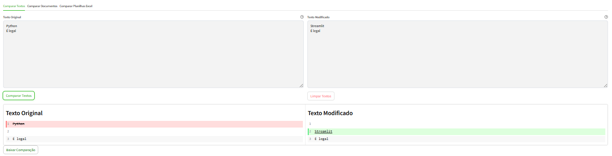
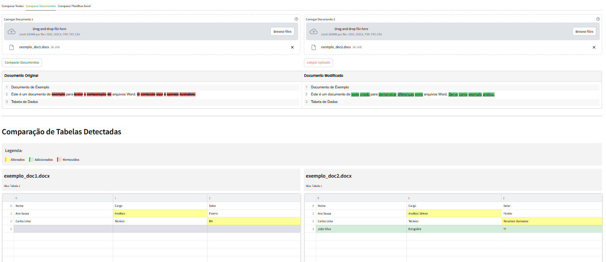
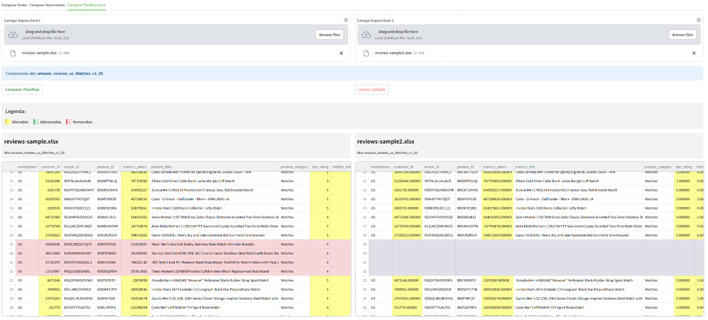

# Comparador

## 🧠 Comparador GNCP

Uma ferramenta feita com Streamlit para comparar **textos, documentos e planilhas** com visual profissional, pensado para facilitar o trabalho na análise de alterações entre versões de arquivos usados na Gerência de Normas e Critérios de Produtividade.

---

## 🚀 Funcionalidades

- 🔍 Comparação de **textos lado a lado** com destaque visual de diferenças.
- 📄 Comparação de **documentos (PDF, Word, TXT, CSV)** com:
  - Detecção de diferenças por linha.
  - Extração e comparação automática de **tabelas internas**.
- 📊 Comparação de **planilhas Excel (.xlsx, .xls)** com:
  - Comparação célula a célula.
  - Detecção inteligente de adições, remoções e alterações.
  - Legenda com cores estilo diffchecker.

---

## 🛠 Tecnologias utilizadas

- [Python 3.11+](https://www.python.org/)
- [Streamlit](https://streamlit.io/)
- Pandas / NumPy
- PyPDF2 / pdfplumber / python-docx
- Openpyxl
- Difflib / SequenceMatcher
- Chardet (detecção de encoding)

---

## ⚙️ Como rodar localmente

1. **Clone o repositório**:

   ```bash
   git clone https://github.com/A4thu4/Comparador.git
   cd Comparador
   ```

2. **Crie o ambiente virtual**:

   ```bash
   python -m venv .venv
   source .venv/bin/activate  # Linux/Mac
   .venv\Scripts\activate   # Windows
   ```

3. **Instale as dependências**:

   ```bash
   pip install -r requirements.txt
   ```

4. **Rode o app**:

   ```bash
   streamlit run main.py
   ```

---

## 📁 Estrutura do Projeto

```bash
📦 Comparador /
├── assets/                 # Imagens
├── Dockerfile              # Arquivo para hospedagem em nuvem com Docker
├── LICENSE                 # Licença 
├── README.md               # Este arquivo
├── main.py                 # Código principal do Streamlit
├── requirements.txt        # Dependências do projeto
```

---

## 📷 Exemplos de uso

### Comparação de textos



### Comparação de documentos



### Comparação de planilhas



---

## 🌐 Link do Comparador

- [COMPARADOR](https://comparador-gncp-sead.streamlit.app/)

---

## 👨‍💻 Desenvolvedor

> Feito por Arthur Mamedes – Estudante de Ciência da Computação e estagiário na Gerência de Normas e Critérios de Produtividade (GNCP).

📬 <arthurmamedesborges@gmail.com>

---

## 📄 Licença

Este projeto está sob a licença [MIT](assets/LICENSE).
